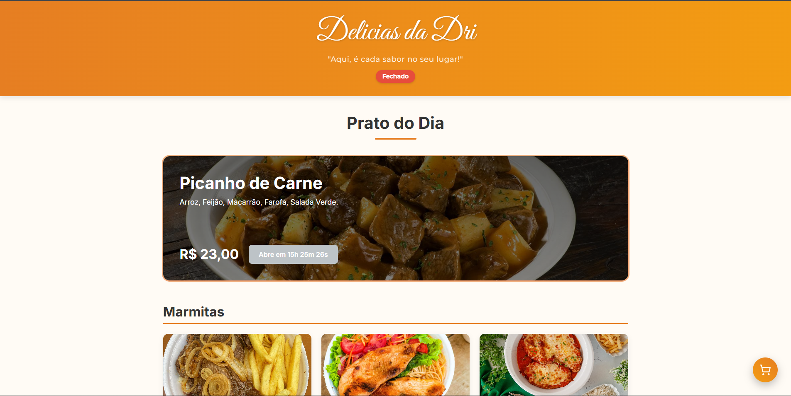
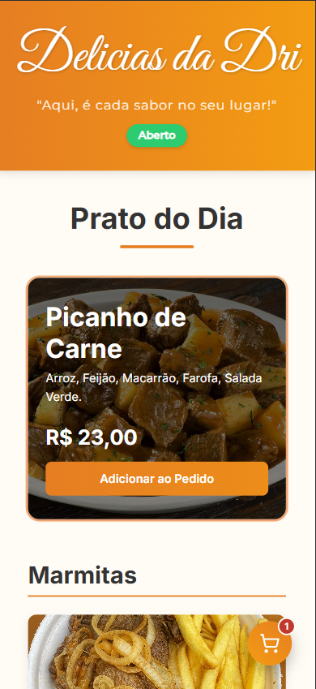

#  Delicias da Dri - Cardápio Digital 🍽️✨


Bem-vindo ao repositório do Cardápio Digital "Delicias da Dri"! Este projeto é uma solução moderna e completa para pequenos negócios de alimentação, desenvolvido como um freelancer para uma cliente especial. A aplicação é totalmente responsiva e oferece um fluxo de pedido intuitivo, desde a escolha dos pratos até a finalização do pagamento.

**[➡️ Acesse a demonstração ao vivo aqui!](https://cardapio-adriana.vercel.app/)**

---

## 📸 Screenshots

<p align="center">
  <strong>Versão para Desktop</strong><br><br>
  
</p>

<p align="center">
  <strong>Versão para Celular</strong><br>><br>
  
</p>

---

## ✨ Funcionalidades Principais

O projeto foi construído do zero, evoluindo com base nas necessidades da cliente. As principais funcionalidades incluem:

-   **Menu Dinâmico:** Apresentação dos produtos divididos por categorias e uma seção especial para o "Prato do Dia".
-   **Status de Atendimento em Tempo Real:** Um indicador visual no cabeçalho mostra se o estabelecimento está **"Aberto"** ou **"Fechado"**.
-   **Contagem Regressiva:** Quando a loja está fechada, os botões de adicionar ao carrinho exibem uma contagem regressiva para o próximo horário de abertura.
-   **Carrinho de Compras Flutuante:** Um ícone de carrinho sempre visível que permite ao cliente acessar seu pedido a qualquer momento.
-   **Notificações Inteligentes:** Feedbacks visuais (toasts) para ações como adicionar um item, carrinho vazio ou erros de formulário, com animações de entrada e saída suaves.
-   **Fluxo de Checkout Completo:**
    -   Opções de **Entrega** ou **Retirada na Loja**.
    -   Cálculo automático de **taxa de entrega**.
    -   Formulário para dados do cliente com validação visual.
    -   Campo de **observações** para o pedido.
-   **Múltiplas Formas de Pagamento:**
    -   **PIX:** Geração de QR Code e código "Copia e Cola" funcionais.
    -   **Dinheiro:** Finalização do pedido via WhatsApp.
    -   **Cartão de Crédito e Débito:** Finalização via WhatsApp com aviso para levar a maquininha.
    -   Cálculo e exibição de **taxa para pagamento no crédito**.
-   **Design Totalmente Responsivo:** A interface se adapta perfeitamente a desktops, tablets e celulares.

---

## 🚀 Tecnologias Utilizadas

Este projeto foi construído com as seguintes tecnologias e bibliotecas:

-   **Framework:** [React](https://reactjs.org/) (com [Vite](https://vitejs.dev/) para um ambiente de desenvolvimento rápido)
-   **Estilização:** [Styled-components](https://styled-components.com/) para CSS-in-JS, permitindo a criação de componentes com estilos dinâmicos e encapsulados.
-   **Ícones:** [Lucide React](https://lucide.dev/guide/packages/lucide-react) para uma biblioteca de ícones leve e consistente.
-   **QR Code:** [qrcode.react](https://github.com/zpao/qrcode.react) para a geração do QR Code do PIX no lado do cliente.
-   **Hooks Personalizados:** Criação do hook `useCountdown` para a lógica da contagem regressiva.
-   **Deploy:** [Vercel](https://vercel.com/) para uma integração contínua e deploy automático a partir do GitHub.

---

## 🛠️ Como Rodar o Projeto Localmente

Para rodar este projeto na sua máquina, siga os passos abaixo.

### Pré-requisitos

-   [Node.js](https://nodejs.org/en/) (versão 16 ou superior)
-   [Yarn](https://classic.yarnpkg.com/en/docs/install) (gerenciador de pacotes)

### Passos

1.  **Clone o repositório:**
    ```bash
    git clone [https://github.com/SEU_USUARIO/NOME_DO_REPOSITORIO.git](https://github.com/SEU_USUARIO/NOME_DO_REPOSITORIO.git)
    ```

2.  **Acesse a pasta do projeto:**
    ```bash
    cd NOME_DO_REPOSITORIO
    ```

3.  **Instale as dependências:**
    ```bash
    yarn install
    ```

4.  **Inicie o servidor de desenvolvimento:**
    ```bash
    yarn dev
    ```

5.  Abra seu navegador e acesse `http://localhost:5173` (ou a porta indicada no seu terminal).

---

## ⚙️ Configurações Importantes

Para que o cardápio funcione com os dados da sua cliente, alguns arquivos precisam ser configurados:

1.  **Chave PIX:**
    -   **Arquivo:** `src/components/PixModal/index.jsx`
    -   **O que mudar:** Altere as constantes `pixKey`, `merchantName` e `merchantCity` com os dados da sua cliente. Lembre-se que chaves de CPF/CNPJ/Telefone devem conter **apenas números**.

2.  **Número do WhatsApp:**
    -   **Arquivo:** `src/components/CheckoutDrawer/index.jsx`
    -   **O que mudar:** Altere a constante `whatsappNumber` para o número que receberá os pedidos.

3.  **Itens do Cardápio:**
    -   **Imagens:** Adicione os arquivos de imagem dos produtos na pasta `src/assets`.
    -   **Importação:** Importe as novas imagens no arquivo `src/assets/images.js`.
    -   **Dados:** Altere o arquivo `src/data/mock.js` para adicionar, remover ou modificar os produtos, usando as variáveis de imagem importadas.

---

## 📄 Licença

Este projeto está sob a licença MIT. Veja o arquivo [LICENSE](LICENSE) para mais detalhes.

